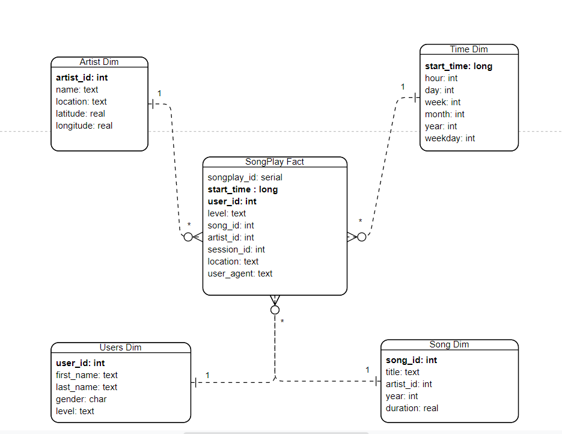

# # Project 1: Song Plays Data Modeling with Postgres

Welcome to my project. This document aims to give an overall around all project files as well how project was developed and how it works.

## Summary

* Introduction
* Data Modeling
* Optimizations
* Project Structure
* How to Run
* Query Examples
* Final Considerations

## Introduction

A startup called Sparkify wants to analyze the data they've been collecting on songs and user activity on their new music streaming app. The analytics team is particularly interested in understanding what songs users are listening to. Currently, they don't have an easy way to query their data, which resides in a directory of JSON logs on user activity on the app, as well as a directory with JSON metadata on the songs in their app.

They'd like a data engineer to create a Postgres database with tables designed to optimize queries on song play analysis, and bring you on the project. Your role is to create a database schema and ETL pipeline for this analysis. You'll be able to test your database and ETL pipeline by running queries given to you by the analytics team from Sparkify and compare your results with their expected results.

In this project, you'll apply what you've learned on data modeling with Postgres and build an ETL pipeline using Python. To complete the project, you will need to define fact and dimension tables for a star schema for a particular analytic focus, and write an ETL pipeline that transfers data from files in two local directories into these tables in Postgres using Python and SQL.

## Data Modeling
In fact, to satisfies Sparkify data need it was used a relational data modeling called **Star Schema**, which we can define Fact and Dimension Tables. The following diagram shows how data was modeled.



*Bold fields means Primary Key*

Each table has it own Primary Key (PK), and it is used to handle duplicate data or invalid insert statements. **In this project I choosed to not use Foreign Key, since songplays has null artist_id and song_id values**, and since PK (on song or artist table) requires not null and unique values, it could be more complex to handle and understand the project.

## Optimizations
Since user activity log files contains a lot of events, use classic `Insert` statements followed by a commit is not the most performant way to ingest data into SQL Tables.

For that reason I used `psycopg2.extras`, allowing me to use `extras.execute_batch` function which can group multiples `Insert` statements inside a batch and them write all data into a single commit operation, avoiding commit and other database's overhead.

## Project Structure

This project is structured in following way:

**/data** - Source of the JSON file, all these files have to be elaborated

-   **/log_data** - A folder that contains files of log files in JSON format generated by this  [event simulator](https://github.com/Interana/eventsim)  based on the songs in the dataset above. These simulate app activity logs from a music streaming app based on specified configurations.
-   **/song_data** - Each file is in JSON format and contains metadata about a song and the artist of that song. The files are partitioned by the first three letters of each song's track ID
-   **/assets** - Basic folder which contains images that are  been used in this document.
-   **etl.ipynb** - A sandbox notebook which helps understand, prepare and test, functions to be used in **etl.py**. It does not contain the most up to date etl code.
-   **test.ipynb** - Another sandbox notebook which allow us query sparkify tables to check if data ingestion steps was ok.
-   **create_tables.py** - This python script uses **sql_queries.py** to drop and create tables and its relationships.
-   **sql_queries.py** - This python scrips contains sql queries related to drop, create, insert and find data into sparkify tables. Most project files uses it to help with table interactions.
 -   **etl.py** - This script read JSON for every file contained in /data folder, parse them,  
    build relations though logical process and ingest data into each sparkify table.

## How to Run
In fact to run this project, you must have Postgres Database instance and Python >= 3.0. They don't have to be running in same instance. If you are using Docker, just make sure both containers are in the same network.

After initial setup, open **create_tables.py and etl.py** files. Look for postgres connection string and change it based on your postgres credentials.

Now everything is ready to run. Just follow the next steps:

1) Run **create_tables.py**. This file should be run every time you want to setup your database environment. As mentioned above, it will drop if exists and recreate all tables.
2) Now you can run **elt.py** to parse json datasets and populate database tables. Since insert statements handle duplicate data, this process is idempotent and can be called several times (the result will not change).

## Query Examples

*List relation between user gender and its payment level*
```sql
select 
	users.level, 
	users.gender, 
	count(1)  
from songplays 
	join users on users.user_id = songplays.user_id 
group by 1,2 
order by gender

```

*Which period of the day users spend more time listening music?*
```sql
select
	case
	    when time.hour between 0 and 6 then 'dawn'
	    when time.hour between 6 and 13 then 'morning'
	    when time.hour between 13 and 19 then 'afternoon'
	    when time.hour between 19 and 24 then 'night'
	end as day_period,
	count(1) as freq
from songplays join time on time.start_time = songplays.start_time
group by 1 
order by freq desc;

```

## Final Comments

As we can see above in query examples, using Star Schema model in this project made your life easier. It's extremely easy to inderstand and extract information from this data model pattern.

## Social Media

Join me on Social Media!
[LinkedIn](https://www.linkedin.com/in/vitor-henrique97/) 
